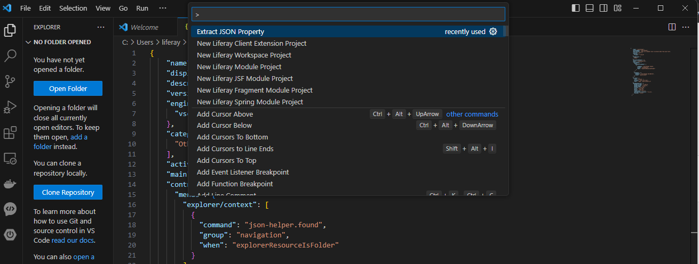

# JSON-Helper

This is a JSON tools to extract data from JSON file.

## Features

This is a json tools to extract property values by given property name.

## Requirements

This is no requirements for now.

## Extension Settings

This extension contributes the following settings:

* `myExtension.enable`: Enable/disable this extension.
* `myExtension.thing`: Set to `blah` to do something.

## Known Issues

Calling out known issues can help limit users opening duplicate issues against your extension.

## Release Notes

Users appreciate release notes as you update your extension.

### 1.0.0

Initial release of JSON-helper